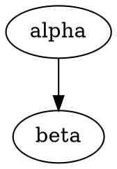

{notoc=1}
# Prologue

{notoc=1}
# Table of contents

{level=1}
```{toc}
```

# Section

Section Lv.1 ATX-style
======================

Section Lv.2 ATX-style
----------------------

# Section Lv.1
## Section Lv.2
### Section Lv.3
#### Section Lv.4
##### Section Lv.5
###### Section Lv.6

# Block-markup

## Paragraph

Paragraph text text text.
New line but ignoreed breakline code.

Next paragraph text text text.
paragraph separated by empty line.

A **strong** text.

(blist)=
## BulletList
* List item 1
  * List item 1-1
    * List item 1-1-1
    * List item 1-1-2
  * List item 1-2
    * List item 1-2-1
  * List item 1-2-2
* List item 2

* List item new 1

(olist)=
## OrderedList

1. List item 1
   1. List item 1-1
      1. List item 1-1-1
      1. List item 1-1-2
   1. List item 1-2
      1. List item 1-2-1
      1. List item 1-2-2
1. List item 2
<!-- -->
1. List item new 1

### Multi Paragraph

1. List item 1 text text.
   new line text text.

   new paragraph text text 1.
   1. List item 1-1

      new paragraph text text 2.

      new paragraph text text 3.

   1. List item 1-2

      new paragraph text text 4.

      new paragraph text text 5.
   <!-- -->
   1. List item new 1-1

      new paragraph text text 6.

   new paragraph text text 7.

   new paragraph text text 8.

1. List item 2

   new paragraph text text 9.

   new paragraph text text 10.

<!-- -->
new paragraph text text new 1.

## DescriptionList

### DefinitionList

Term1
: List item 1

  Term1-1
  : List item 1-1

    Term1-1-1
    : List item 1-1-1

    Term1-1-2
    : List item 1-1-2

  Term1-2
  : List item 1-2

    Term1-2-1
    : List item 1-2-1

    Term1-2-2
    : List item 1-2-2

Term2
: List item 2

Term3
: List item 1a
: List item 1b

### FieldList

:Term 1: List item 1
:Term 2: List item 2
:Term 3: List: item 3
  next line.

  next paragraph.

  :Term 3-1: List item 1
  :Term 3-2: List item 2
:Term 4: List item 4
:Term 5:
:Term 6: List item 6

## CheckList

* [ ] List item 1
  * [-] List item 1-1 (unsupported)
    * [x] List item 1-1-1
    * [ ] List item 1-1-2
  * [x] List item 1-2
    * [x] List item 1-2-1
    * [x] List item 1-2-2
* [ ] List item 2
<!-- -->
* [x] List item new 1

[ ] unchecked, [x] checked, [-] indeterminate (unsupported)

## Mixed List

* List item 1
  1. List item 1-1

     A
     : List item 1-1-1

     B
     : List item 1-1-2

  1. List item 1-2
     * [x] List item 1-2-1
     * [ ] List item 1-2-2

* List item 2

## Table

### BasicTable

| head11 | head12 | head13 |
|:-------|:------:|-------:|
| data11 | data12 | data13 |
| data`21` | data22 | data23 |
| a | b | c |

| head11 | head12 | :<     | :<     |
|--------|--------|--------|--------|
| data11 | data12 | data13 | data14 |
| data21 | data22 | :<      | data24 |
| data31 | :^     | :<      | :^     |
| data41 | data42 | :<      | data44 |
| data51 | data52 | data53 |:<data54 |
| data61 |:^data62 |:^data63 |:<data64 |

```{table}
:w: 600px
:widths: 1,2,3
| head11 | head12 | head13 |
| head21 | head22 | head23 |
|:-------|:------:|-------:|
| data11 | data12 | data13 |
| data`21` | data22 | data23 |
| a | b | c |
```

```{table}
|:------:|-------:|+-------|
| data11 | data12 | data13 |
| A | B | C |
```

```{table}
| head11 | head12 | head13 |
|+-------|+------+|-------+|
| data11 | data12 | data13 |
```

### ListTable

```{list-table}
:header-rows: 1

* - head1
  - head2
  - head3
* - data11
  - data12
  - data13
* - data21
  - data22
  - data23
```

```{list-table}
:header-rows: 1

* - head1
  - head2
  - :<
* - data11
  - data12
  - data13
* - data21
  - :^data22
  - data23
```

```{list-table}
:align: lcr
:header-rows: 1

* - head1
  - head2
  - head3
* - data11
  - data12
  - 

* - * item1
    * item2
    * item3
  - `data22`
  - data23

* - A
  - B
  - C
```

```{list-table}
:header-rows: 1
:colspec: 5l,3c,1r
* - head1
  - head2
  - head3
* - data11
  - data12
  - data13
* - data21
  - data22
  - data23
```

### Nested Table

```{list-table}
* - A
  - B
    | a | b |
    |---|---|
    | c | d |
  - C
* - D
    ```{list-table}
    * - a
      - b
    * - c
      - 
        ```{list-table}
        * - a
          - b
        * - c
          - d
        ```
    ```
  - E
  - F
```

## Figure

```{figure} caption

```

```{figure} caption
[Not Image.]
```

```{figure} caption
| head11 | head12 | head13 |
|--------|--------|--------|
| data11 | data12 | data13 |
| data21 | data22 | data23 |
```

## QuoteBlock

> Quote text text text.
> new line text.
> > Nested quote text.
> return first quote.

> New quote text.

## LiteralBlock

Unsupported.

## AdmonitionBlock

!!! note
    This is a note.
    new line text.

    admonition can include blocks.

    *  ATTENTION
    *  HINT
    *  NOTE
    *  TIP
    *  WARNNING

## CodeBlock

```c
#include <stdio.h>
# include <stdlib.h>
int main()
{
  int x           = 1;
  long long int y = 2;
  char s[100] = "Good morning!\n";
  printf("Hello World!!\n");
  exit(0);
}
```

  ```sh
  pushd ~
  cat .bashrc
  popd
  ```

```
80 characters
12345678901234567890123456789012345678901234567890123456789012345678901234567890
```

```{literalinclude} ./example.c
:language: c
```

```{literalinclude} ./example.c
:language: c
```

## CustomBlock



## HorizonBlock

paragraph

+++

paragraph

# Inline-markup

## Text Decoration

The *emphasis* **strong** ++inserted++ ~~deleted~~ ***strong & emphasis*** text.

The x^sup^x x~sub~x text.

The ⫶var⫶ and `code` text.

## Color Decoration

The `🔴color1` `🟡color2` `🟢color3` `🔵color4` `🟣color5` color text.

``🔵Color `🟣decoration` can`` be nested.

## Image

Image in paragraph like .

Image in paragraph like {w=150px}.

Image in paragraph like {w="20%"}.

Image in paragraph like {w=150px}.

## Include

==Start of include 1st==

```{include} ./sub/sub1.md
```

==End of include 1st==

==Start of include 2nd==

```{include} ./sub/sub1.md
```

==End of include 2nd==

==Start of include 3rd : other type document ==

```{include} ./sub2.tglyph
```

## Keyboard / Button / Menu

Type {kbd}`Ctrl A` right now.

Click {btn}`OK` or {btn}`Cancel`.

Select {menu}`Edit > Settings > <Language> > preference` to edit settings.

## HyperLink

Search [](https://www.yahoo.com/) !

For more information, check [here](https://www.google.com/) !

[](https://www.yahoo.com/) and [](https://www.google.com/)

## CrossReference

Block markup section: [](#Block-markup)!

[Here](#Block-markup) is the same!

[](#blist) is referenced by id.

[Orderd List Section](#olist) is referenced by id too.

Other document section: ⸨./sub/sub1.md#section-1-2⸩

「[](#セクション1-1)」のようにIDには多言語文字が使えます。

タイトルから自動で割り振られるIDが重複する場合、2つ目以降は連番が振られます：

* [Section Name](#section-name)
* [Section Name (1)](#section-name-1)
* [Section Name (2)](#section-name-2)

### Section Name

aaa

### Section Name

bbb

### Section Name

ccc

## Footnote

The important text. {footnote}`1` And the important text too. {footnote}`2`

```{footnote}
:1: This is footnote.
:2: This is footnote too.
```

## Refenrence / Bibliography

The important text. {cite}`1` And the important text too. {cite}`2`

```{reference}
:1: The Awesome Document, 1990, Anonymous.
:2: The theory of theory, 2000-01-01, Anonymous.
:3: Unreferenced bibliograpy I, 2XXX-XX-XX, Anonymous.
:4: Unreferenced bibliograpy II, 2XXX-XX-XX, Anonymous.
```

# Multibyte Support

## セクション1-1

本文ホンブンほんぶんText

```
本文ホンブンほんぶんText
```

# Config

## Replace

Hello, I am {}.

Replace in decoration text like *{}*, `{}`.

* Replace in decoration text like *{}*, `{}`.

:Replace {}: ⸌{}⸌
:Replace ⸌{}⸌: {}

```
var = "{}"
```

# Torture

## Wide Table

```{list-table}
:align: llx
* - 128456789012345678901234567890
  - abcdefg
  - The `long_long_long_long code` and `longlonglonglonglonglonglonglonglonglonglonglonglonglonglonglonglonglonglonglong code` text.
```

## Merged Wide Table

```{table}
:widths: 1,1,1,2,1,1,1,1,1,1
| head11 | head12 | head13 | head14 | head15 | head16 | head17 | head18 | head19 | :<     |
| head21 | :<     | :<     | head24 | :^     | head26 | head27 | head28 | head29 | head2a |
|+-------|+------+|+------+|-------+|+------+|+------+|+------+|+------+|+------+|+------+|
| data11 | data12 | data13 | data14 | data15 | data16 | data17 | data18 | data19 | data1a |
| data21 | data22 | data23 | data24 | data25 | data26 | data27 | data28 | data29 | data2a |
| data31 | data32 longlong longlong text | :<     | data34 | data35 | data36 | data37 | data38 | data39 | data3a |
| data41 | data42 | data43 | data44 | data45 | data46 | data47 | data48 | data49 | data4a |
```

```{table}
:type: long
:fontsize: small
| head11 | head12 | head13 | head14 | head15 | head16 | head17 | head18 | head19 | :<     |
| head21 | :<     | :<     | head24 | :^     | head26 | head27 | head28 | head29 | head2a |
|:------:|:------:|:------:|:------:|:------:|:------:|:------:|:------:|:------:|:------:|
| data11 | data12 | data13 | data14 | data15 | data16 | data17 | data18 | data19 | data1a |
| data21 | data22 | data23 | data24 | data25 | data26 | data27 | data28 | data29 | data2a |
| data31 | data32 longlong longlong text | :<     | data34 | data35 | data36 | data37 | data38 | data39 | data3a |
| data41 | data42 | data43 | data44 | data45 | data46 | data47 | data48 | data49 | data4a |
| datax1 | datax2 | datax3 | datax4 | datax5 | datax6 | datax7 | datax8 | datax9 | dataxa |
| datax1 | datax2 | datax3 | datax4 | datax5 | datax6 | datax7 | datax8 | datax9 | dataxa |
| datax1 | datax2 | datax3 | datax4 | datax5 | datax6 | datax7 | datax8 | datax9 | dataxa |
| datax1 | datax2 | datax3 | datax4 | datax5 | datax6 | datax7 | datax8 | datax9 | dataxa |
| datax1 | datax2 | datax3 | datax4 | datax5 | datax6 | datax7 | datax8 | datax9 | dataxa |
| datax1 | datax2 | datax3 | datax4 | datax5 | datax6 | datax7 | datax8 | datax9 | dataxa |
| datax1 | datax2 | datax3 | datax4 | datax5 | datax6 | datax7 | datax8 | datax9 | dataxa |
| datax1 | datax2 | datax3 | datax4 | datax5 | datax6 | datax7 | datax8 | datax9 | dataxa |
| datax1 | datax2 | datax3 | datax4 | datax5 | datax6 | datax7 | datax8 | datax9 | dataxa |
| datax1 | datax2 | datax3 | datax4 | datax5 | datax6 | datax7 | datax8 | datax9 | dataxa |
| datax1 | datax2 | datax3 | datax4 | datax5 | datax6 | datax7 | datax8 | datax9 | dataxa |
| datax1 | datax2 | datax3 | datax4 | datax5 | datax6 | datax7 | datax8 | datax9 | dataxa |
| datax1 | datax2 | datax3 | datax4 | datax5 | datax6 | datax7 | datax8 | datax9 | dataxa |
| datax1 | datax2 | datax3 | datax4 | datax5 | datax6 | datax7 | datax8 | datax9 | dataxa |
| datax1 | datax2 | datax3 | datax4 | datax5 | datax6 | datax7 | datax8 | datax9 | dataxa |
| datax1 | datax2 | datax3 | datax4 | datax5 | datax6 | datax7 | datax8 | datax9 | dataxa |
| datax1 | datax2 | datax3 | datax4 | datax5 | datax6 | datax7 | datax8 | datax9 | dataxa |
| datax1 | datax2 | datax3 | datax4 | datax5 | datax6 | datax7 | datax8 | datax9 | dataxa |
| datax1 | datax2 | datax3 | datax4 | datax5 | datax6 | datax7 | datax8 | datax9 | dataxa |
| datax1 | datax2 | datax3 | datax4 | datax5 | datax6 | datax7 | datax8 | datax9 | dataxa |
| datax1 | datax2 | datax3 | datax4 | datax5 | datax6 | datax7 | datax8 | datax9 | dataxa |
| datax1 | datax2 | datax3 | datax4 | datax5 | datax6 | datax7 | datax8 | datax9 | dataxa |
| datax1 | datax2 | datax3 | datax4 | datax5 | datax6 | datax7 | datax8 | datax9 | dataxa |
| datax1 | datax2 | datax3 | datax4 | datax5 | datax6 | datax7 | datax8 | datax9 | dataxa |
| datax1 | datax2 | datax3 | datax4 | datax5 | datax6 | datax7 | datax8 | datax9 | dataxa |
| datax1 | datax2 | datax3 | datax4 | datax5 | datax6 | datax7 | datax8 | datax9 | dataxa |
| datax1 | datax2 | datax3 | datax4 | datax5 | datax6 | datax7 | datax8 | datax9 | dataxa |
| datax1 | datax2 | datax3 | datax4 | datax5 | datax6 | datax7 | datax8 | datax9 | dataxa |
| datax1 | datax2 | datax3 | datax4 | datax5 | datax6 | datax7 | datax8 | datax9 | dataxa |
| datax1 | datax2 | datax3 | datax4 | datax5 | datax6 | datax7 | datax8 | datax9 | dataxa |
| datay1 | datax2 | datax3 | datax4 | datax5 | datax6 | datax7 | datax8 | datax9 | dataxa |
| datay1 | datax2 | datax3 | datax4 | datax5 | datax6 | datax7 | datax8 | datax9 | dataxa |
| datay1 | datax2 | datax3 | datax4 | datax5 | datax6 | datax7 | datax8 | datax9 | dataxa |
| datay1 | datax2 | datax3 | datax4 | datax5 | datax6 | datax7 | datax8 | datax9 | dataxa |
| datay1 | datax2 | datax3 | datax4 | datax5 | datax6 | datax7 | datax8 | datax9 | dataxa |
| datay1 | datax2 | datax3 | datax4 | datax5 | datax6 | datax7 | datax8 | datax9 | dataxa |
| datay1 | datax2 | datax3 | datax4 | datax5 | datax6 | datax7 | datax8 | datax9 | dataxa |
| datay1 | datax2 | datax3 | datax4 | datax5 | datax6 | datax7 | datax8 | datax9 | dataxa |
| datay1 | datax2 | datax3 | datax4 | datax5 | datax6 | datax7 | datax8 | datax9 | dataxa |
| datay1 | datax2 | datax3 | datax4 | datax5 | datax6 | datax7 | datax8 | datax9 | dataxa |
| datay1 | datax2 | datax3 | datax4 | datax5 | datax6 | datax7 | datax8 | datax9 | dataxa |
| datay1 | datax2 | datax3 | datax4 | datax5 | datax6 | datax7 | datax8 | datax9 | dataxa |
| datay1 | datax2 | datax3 | datax4 | datax5 | datax6 | datax7 | datax8 | datax9 | dataxa |
| datay1 | datax2 | datax3 | datax4 | datax5 | datax6 | datax7 | datax8 | datax9 | dataxa |
```

## Long Table

```{list-table}
:type: long
* - 128456789012345678901234567890
  - abcdefg
  - abcdefg
* - 128456789012345678901234567890
  - abcdefg
  - abcdefg 0
```
